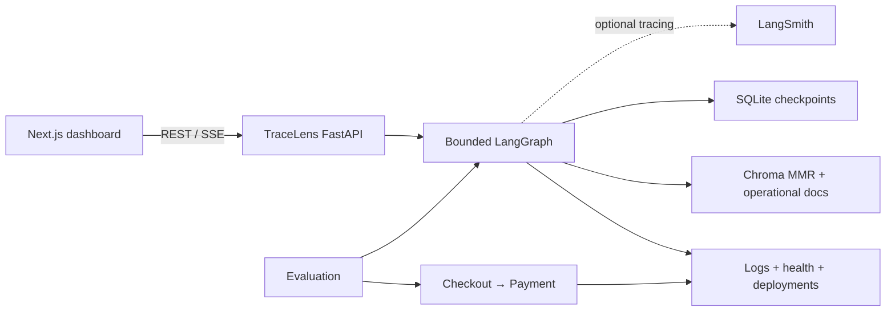

# TraceLens

TraceLens is an evidence-first software incident investigation platform for a controlled,
executable Incident Lab. It correlates real service logs, deployment metadata, health checks, and
retrieved operational knowledge; then it produces a typed, verified report whose citations must
resolve to collected evidence.

The project exists to demonstrate where graph orchestration, retrieval, structured model output,
durable execution, and evaluation naturally fit an incident workflow. It is not a chatbot and it
does not take autonomous production actions.

## Screenshots

The primary product surfaces are Overview, Incidents, Incident Detail, Incident Lab, and
Evaluations. Screenshots are not checked in as static marketing artifacts; run the local stack to
see the screens backed by the current runtime and evaluation data.

## System architecture



See [architecture](docs/architecture.md) for component and trust boundaries and
[investigation flow](docs/investigation-flow.md) for every node, state field, and routing rule.

## Investigation workflow

`load_incident → collect_runtime_context → analyze_runtime_evidence →
retrieve_operational_knowledge → generate_hypothesis → verify_hypothesis`

Sufficient evidence routes to report generation. Insufficient evidence refines the retrieval query
and loops through retrieval, hypothesis, and verification, with three total attempts maximum. When
the bound is reached, TraceLens produces the best supported report and states its limitations.

Important model calls use Pydantic structured output. Model-produced evidence IDs are resolved
against the evidence registry; unknown IDs are removed and recorded. With no OpenAI key, a typed
deterministic local reasoner keeps the lab, graph, persistence, UI, and tests usable and labels that
limitation in reports.

## Incident Lab

The lab contains two FastAPI services. Checkout calls payment over HTTP, forwards request IDs, and
enforces a one-second timeout. Five scenarios change actual payment behavior:

- `baseline`
- `payment_latency`
- `payment_failure`
- `bad_deployment`
- `connection_exhaustion`

Logs are JSONL records under `data/runtime`. Scenario control state is ground truth and is never
read by investigation nodes. See [Incident Lab](incident_lab/README.md).

## RAG pipeline

Ten focused Markdown knowledge sections cover service architecture, runbooks, and prior incidents.
Ingestion preserves source/type/service/failure metadata, splits at 800 characters with 120 overlap,
uses configured OpenAI embeddings, and persists to Chroma. The default retriever is MMR (`k=5`,
`fetch_k=10`). A local hash embedding exists only for credential-free development and tests.

Future similarity comparisons, MultiQuery, contextual compression, and corrective RAG are listed
in the [roadmap](docs/roadmap.md), not implemented in V1.

## Persistence and streaming

SQLite stores incidents, durable semantic events, reports, and evaluation summaries.
`langgraph-checkpoint-sqlite` stores a checkpoint after every graph super-step with the incident ID
as `thread_id`. `POST /api/incidents/{id}/resume` continues a terminated investigation from the
latest checkpoint. The SSE endpoint replays events by ID, so reconnecting clients do not lose
workflow progress.

## LangSmith observability

Set `LANGSMITH_TRACING=true`, `LANGSMITH_API_KEY`, and optionally `LANGSMITH_PROJECT`. LangGraph and
LangChain traces include incident/thread ID, environment, graph version, and retriever strategy.
Tracing is disabled cleanly when credentials are absent; keys remain backend-only.

## Evaluation

The evaluation boundary owns scenario ground truth. `make eval` activates each scenario, generates
real traffic, runs the production investigation graph, and measures:

- exact root-cause category correctness
- exact affected-service correctness
- retrieval relevance from preserved failure metadata
- evidence groundedness by citation resolution

The five-example dataset favors reproducibility over synthetic volume. Summaries persist locally
for the Evaluations page. See [evaluation methodology](evaluation/README.md).

## Technology stack

- Python 3.11+, FastAPI, Pydantic, LangChain, LangGraph, Chroma, SQLite, LangSmith, pytest
- Next.js 16, React 19, TypeScript, Tailwind CSS 4, Lucide icons
- REST for records and control; SSE for investigation progress

## Repository structure

```text
backend/       API, domain models, graph, RAG, persistence, tests
incident_lab/  checkout/payment services, scenarios, runtime storage
knowledge/     architecture, runbooks, postmortems
evaluation/    ground-truth dataset and evaluators
frontend/      Next.js operations interface
docs/          architecture, graph flow, roadmap
```

## Local setup

Requirements: Python 3.11 or newer, Node.js 20 or newer, and npm.

```bash
cp .env.example .env
make install
make ingest
```

Open four terminals:

```bash
make lab-payment
make lab-checkout
make backend
make frontend
```

Open `http://127.0.0.1:3000`. The frontend expects the backend at
`http://127.0.0.1:8000` unless `NEXT_PUBLIC_API_BASE_URL` overrides it.

## Environment variables

| Variable | Purpose |
|---|---|
| `OPENAI_API_KEY` | Enables OpenAI structured reasoning and embeddings |
| `OPENAI_CHAT_MODEL` | Structured reasoning model |
| `OPENAI_EMBEDDING_MODEL` | Chroma embedding model |
| `LANGSMITH_TRACING` | Enables tracing when set to `true` with a key |
| `LANGSMITH_API_KEY` | Backend-only LangSmith credential |
| `LANGSMITH_PROJECT` | Trace project, default `tracelens-dev` |
| `CHROMA_PERSIST_DIRECTORY` | Local vector-store path |
| `DATABASE_URL` | V1 `sqlite:///...` application database |
| `CHECKPOINT_DATABASE_PATH` | LangGraph SQLite checkpoint file |
| `RUNTIME_DIRECTORY` | Incident Lab logs and deployment metadata |
| `NEXT_PUBLIC_API_BASE_URL` | Browser-visible API origin |

## Example investigation

```bash
.venv/bin/python -m incident_lab.scenarios reset
.venv/bin/python -m incident_lab.scenarios activate payment_latency
.venv/bin/python -m incident_lab.scenarios traffic --count 12
```

In the UI, create an incident and start its investigation. Checkout logs will show 504 timeouts near
one second; payment logs with the same request IDs will complete near 1.8 seconds. The graph should
retrieve the payment latency runbook/postmortem and report payment latency beyond checkout's budget,
with resolvable log and document citations.

Run checks and the evaluation dataset with:

```bash
make test
make lint
make eval
```

## Design principles

- Evidence over eloquence
- Deterministic collection and routing where ordinary code is reliable
- Explicit checkpoint-friendly incident state
- Bounded reasoning and typed outputs
- Observable semantic progress without chain-of-thought exposure
- Compact operations UX rather than AI-product decoration

## Limitations

V1 reads local JSONL evidence rather than an external observability platform. Health checks are
point-in-time and intentionally shallow. Evidence confidence is a deterministic support score
derived from unique correlated runtime requests, corroborating sources, contradictions, unresolved
questions, and verification sufficiency. It is not a calibrated probability of diagnosis
correctness. The local embedding/reasoning fallbacks support development but do not replace the
configured OpenAI path for evaluation of model behavior. Authentication, external integrations,
automated remediation, and multi-tenant operation are out of scope.

## Roadmap

See [docs/roadmap.md](docs/roadmap.md). Future work is deliberately documented without scaffolding
unused systems in V1.
