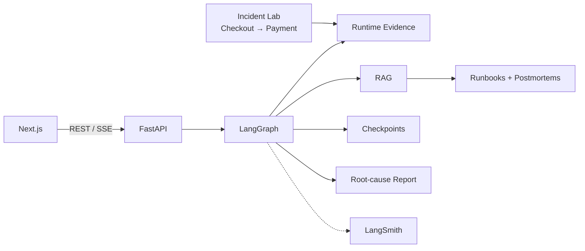

# TraceLens

**Evidence-driven incident investigation with LangGraph, RAG, and runtime telemetry.**

TraceLens investigates failures in a small distributed system by correlating service logs, deployment history, health signals, and operational knowledge. It produces a structured root-cause report with citations back to the evidence used during the investigation.

Instead of asking an LLM to diagnose an incident in a single call, TraceLens runs a bounded workflow:

**Context → Runtime → Retrieval → Hypothesis → Verification → Report**

**[Live Demo](https://tracelens-seven.vercel.app)**

> The demo backend runs on Render's free tier and may take a short time to wake after inactivity.

---

## Demo

<!-- Replace this with the demo GIF later -->

**Demo GIF coming soon**

<!--

-->

---

## Why I built this

LLMs can explain logs, but incident investigation needs more than a plausible explanation. A diagnosis should be supported by runtime evidence and operational context.

TraceLens separates **evidence collection from model reasoning**.

Logs, deployments, and health checks are collected deterministically. RAG retrieves relevant runbooks and postmortems, while LangGraph controls hypothesis generation, verification, retries, and report generation.

Model-generated evidence references are validated before appearing in the final report.

---

## How it works

```text
Incident
   │
   ▼
Collect runtime evidence
   │
   ├── Logs
   ├── Deployments
   └── Health
   │
   ▼
Analyze runtime context
   │
   ▼
Retrieve runbooks + postmortems
   │
   ▼
Generate hypothesis
   │
   ▼
Verify against evidence
   │
   ├── insufficient → retrieve again
   │
   └── sufficient
           │
           ▼
     Root-cause report
```

The investigation loop is bounded. If evidence is insufficient, TraceLens can refine retrieval and retry instead of blindly producing a diagnosis.

---

## Incident Lab

TraceLens includes an executable Incident Lab so investigations run against **reproducible failures rather than fabricated logs**.

A checkout service calls a payment service over HTTP. Both emit correlated logs using the same request ID.

| Scenario | Failure |
| --- | --- |
| `baseline` | Normal operation |
| `payment_latency` | Payment exceeds checkout timeout |
| `payment_failure` | Payment operation fails |
| `bad_deployment` | Invalid provider configuration |
| `connection_exhaustion` | Payment connection pool is exhausted |

The investigation graph never reads the active scenario directly. It has to infer the failure from the same runtime evidence exposed during an investigation.

---

## Architecture



The investigation graph follows:

```text
load incident
    ↓
collect context
    ↓
analyze runtime
    ↓
retrieve knowledge
    ↓
generate hypothesis
    ↓
verify
    ↓
generate report
```

See [`docs/architecture.md`](docs/architecture.md) and [`docs/investigation-flow.md`](docs/investigation-flow.md) for the deeper design.

---

## Engineering highlights

- **Evidence-backed reports** — model citations are resolved against collected evidence before being accepted.
- **Bounded LangGraph workflow** — insufficient evidence can trigger another retrieval/verification cycle without creating an unbounded agent loop.
- **Checkpoint + resume** — investigations persist their graph state and can continue after interruption.
- **RAG** — operational knowledge comes from architecture docs, runbooks, and previous postmortems using MMR retrieval.
- **SSE streaming** — investigation stages appear live in the UI as the graph executes.
- **LangSmith tracing** — graph execution, retrieval, and model calls can be inspected outside the application.

---

## Evaluation

TraceLens includes a small evaluation harness built around the same Incident Lab used by the application.

Each known scenario can generate real traffic, run through the investigation graph, and be evaluated for:

- root-cause correctness
- affected-service correctness
- retrieval relevance
- evidence citation validity

See [`evaluation/README.md`](evaluation/README.md) for details.

---

## Tech stack

| | |
| --- | --- |
| **AI** | LangGraph, LangChain, OpenAI |
| **RAG** | Chroma, OpenAI embeddings |
| **Backend** | Python, FastAPI, Pydantic |
| **Frontend** | Next.js, React, TypeScript |
| **Persistence** | SQLite / PostgreSQL |
| **Observability** | LangSmith |
| **Hosting** | Vercel, Render, Supabase |

---

## Run locally

Requirements: **Python 3.11+**, **Node.js 20+**, and npm.

```bash
git clone git@github.com:dumpydon/TraceLens.git
cd TraceLens

cp .env.example .env

make install
make ingest
```

Start the four processes:

```bash
make lab-payment
make lab-checkout
make backend
make frontend
```

Then open:

```text
http://127.0.0.1:3000
```

---

## Repository

```text
backend/        FastAPI, LangGraph, RAG and persistence
frontend/       Next.js interface
incident_lab/   Failure scenarios and test services
knowledge/      Runbooks, architecture docs and postmortems
evaluation/     Evaluation dataset and metrics
docs/           Deeper technical documentation
```

---

## Deployment

The hosted demo uses:

**Vercel** → Next.js frontend  
**Render** → FastAPI + LangGraph backend  
**Supabase** → PostgreSQL  
**OpenAI** → reasoning + embeddings  
**LangSmith** → tracing

The frontend and backend redeploy automatically from the production branch.

---

## Current scope

TraceLens V1 focuses on **reproducible, evidence-grounded incident investigation**.

It is not intended to be a full observability platform or autonomous remediation system. Authentication, external telemetry integrations, multi-tenancy, and automated remediation are intentionally outside V1.

Future work includes human-in-the-loop investigation, stronger evaluations, corrective RAG, richer failure scenarios, MCP integrations, and external observability sources.

See [`docs/roadmap.md`](docs/roadmap.md).

---

**V1 is live:** [tracelens-seven.vercel.app](https://tracelens-seven.vercel.app)
