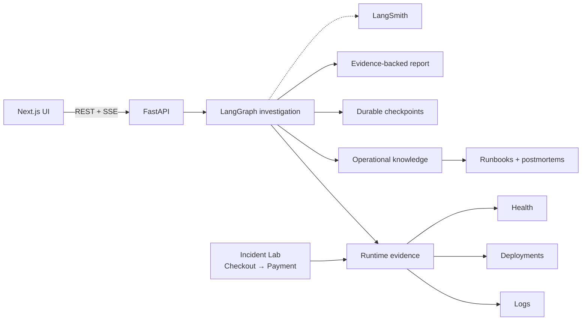

# TraceLens

**Evidence-driven incident investigation with LangGraph, RAG, and runtime telemetry.**

TraceLens investigates failures in a small distributed system by correlating service logs, deployment history, health signals, and operational knowledge. It turns that evidence into a structured root-cause report with citations back to the sources used during the investigation.

Rather than asking an LLM to diagnose an incident in a single call, TraceLens runs a bounded investigation workflow:

**Context → Runtime → Retrieval → Hypothesis → Verification → Report**

**[Live Demo](https://tracelens-seven.vercel.app)**

> The hosted backend runs on Render's free tier and may take a short time to wake after a period of inactivity.

---

## Demo

<!--
Replace this block with the TraceLens demo GIF later.

Recommended:
docs/assets/tracelens-demo.gif

Example:

-->

**Demo GIF coming soon**

<!-- Optional screenshots can go directly below the GIF.

| Incident Lab | Investigation |
| --- | --- |
|  |  |

-->

---

## Why TraceLens?

LLMs are good at explaining logs, but incident investigation needs more than an explanation.

A useful diagnosis has to answer:

- What actually happened?
- Which services were involved?
- What changed before the failure?
- Which runtime signals support the diagnosis?
- Does operational documentation corroborate it?
- Can every important claim be traced back to evidence?

TraceLens separates **evidence collection** from **model reasoning**.

Runtime context is collected deterministically. Operational knowledge is retrieved through RAG. LangGraph controls the investigation loop. Model-generated evidence references are validated before they are allowed into the final report.

The result is an investigation that can be inspected rather than just trusted.

---

## How an investigation works

```text
Incident
   │
   ▼
Collect runtime context
   │
   ├── service logs
   ├── deployment history
   └── health checks
   │
   ▼
Analyze runtime evidence
   │
   ▼
Retrieve operational knowledge
   │
   ├── runbooks
   ├── architecture docs
   └── previous postmortems
   │
   ▼
Generate hypothesis
   │
   ▼
Verify against collected evidence
   │
   ├── insufficient evidence ──► refine retrieval ──┐
   │                                                │
   └── sufficient evidence                         │
          │                                         │
          ▼                                         │
   Generate report ◄────────────────────────────────┘
```

The reasoning loop is bounded to prevent an investigation from retrying indefinitely. If the available evidence is still incomplete, TraceLens produces the best supported report it can and records the remaining limitations.

---

## Incident Lab

TraceLens includes an executable Incident Lab so investigations operate on reproducible failures instead of fabricated logs.

The lab models a checkout service calling a payment service over HTTP. Both services emit correlated runtime evidence using the same request ID.

Five scenarios are currently available:

| Scenario | Behavior |
| --- | --- |
| `baseline` | Checkout and payment operate normally |
| `payment_latency` | Payment exceeds checkout's timeout budget |
| `payment_failure` | The upstream payment operation fails |
| `bad_deployment` | Payment runs with invalid provider configuration |
| `connection_exhaustion` | Payment's connection pool becomes unavailable |

For example, under `payment_latency`, checkout can return a `504 UpstreamPaymentTimeout` while the corresponding payment request completes later. TraceLens has to correlate those events rather than infer the failure from scenario state.

**The investigation graph never reads the active scenario as ground truth.**

That separation keeps the lab useful for testing the investigation system itself.

---

## Architecture



### Investigation graph

```text
load_incident
      ↓
collect_runtime_context
      ↓
analyze_runtime_evidence
      ↓
retrieve_operational_knowledge
      ↓
generate_hypothesis
      ↓
verify_hypothesis
      │
      ├── insufficient ──► retrieve again
      │
      └── sufficient
              ↓
        generate_report
```

More detail is available in:

- [`docs/architecture.md`](docs/architecture.md)
- [`docs/investigation-flow.md`](docs/investigation-flow.md)

---

## Key engineering decisions

### Evidence-backed reasoning

Logs, health checks, deployments, and retrieved documents are registered as evidence during an investigation.

The model references evidence by ID, and those IDs are resolved against the collected evidence registry before the report is accepted. Unknown references are discarded rather than presented as valid citations.

### Bounded LangGraph orchestration

LangGraph owns the investigation state and routing.

If verification determines that evidence is insufficient, the graph can refine retrieval and try again. The loop has a fixed upper bound so execution remains predictable.

### Durable investigations

Each incident is also a LangGraph thread.

Local development uses SQLite checkpoints, while the hosted deployment stores checkpoints in PostgreSQL. An interrupted investigation can resume from its persisted state instead of restarting from the beginning.

### RAG over operational knowledge

The retrieval corpus contains architecture documentation, runbooks, and previous postmortems.

Documents are chunked with metadata and retrieved using MMR so the reasoning stage receives a small set of relevant but non-redundant operational references.

### Live investigation progress

The backend emits semantic investigation events over Server-Sent Events (SSE).

The UI can display progress through context collection, retrieval, hypothesis generation, verification, and report generation without exposing private model reasoning.

### Observability

LangSmith tracing can be enabled for LangChain and LangGraph execution.

Traces include investigation identifiers and graph metadata, making it possible to inspect model calls, retrieval behavior, and graph execution outside the application UI.

---

## Evaluation

TraceLens includes a small reproducible evaluation harness built around the Incident Lab.

For each known scenario, the evaluator can generate real traffic, run the same investigation graph used by the application, and compare the result against scenario ground truth.

Current evaluation signals include:

- root-cause classification
- affected-service identification
- retrieval relevance
- evidence citation validity

The goal is not to manufacture a large benchmark. The dataset is intentionally small enough that every failure can be reproduced and inspected.

See [`evaluation/README.md`](evaluation/README.md) for the evaluation flow.

---

## Tech stack

| Layer | Technology |
| --- | --- |
| Orchestration | LangGraph |
| LLM / embeddings | OpenAI |
| Retrieval | LangChain + Chroma |
| Backend | Python, FastAPI, Pydantic |
| Frontend | Next.js, React, TypeScript |
| Local persistence | SQLite |
| Hosted persistence | PostgreSQL / Supabase |
| Streaming | Server-Sent Events |
| Observability | LangSmith |
| Testing | pytest |
| Frontend hosting | Vercel |
| Backend hosting | Render |

---

## Repository structure

```text
TraceLens/
├── backend/          FastAPI API, LangGraph workflow, RAG and persistence
├── frontend/         Next.js operations interface
├── incident_lab/     Checkout/payment services and failure scenarios
├── knowledge/        Runbooks, architecture notes and postmortems
├── evaluation/       Evaluation dataset and evaluators
├── docs/             Architecture, investigation flow and roadmap
└── Makefile          Local development commands
```

---

## Run locally

### Requirements

- Python 3.11+
- Node.js 20+
- npm

Clone the repository and configure the environment:

```bash
git clone git@github.com:dumpydon/TraceLens.git
cd TraceLens

cp .env.example .env

make install
make ingest
```

Add your OpenAI credentials to `.env` if you want to run the model-backed investigation path.

Start the local system in four terminals:

**Payment service**

```bash
make lab-payment
```

**Checkout service**

```bash
make lab-checkout
```

**TraceLens backend**

```bash
make backend
```

**Frontend**

```bash
make frontend
```

Then open:

```text
http://127.0.0.1:3000
```

---

## Try an incident

Activate the payment-latency scenario:

```bash
.venv/bin/python -m incident_lab.scenarios activate payment_latency
```

Generate traffic:

```bash
.venv/bin/python -m incident_lab.scenarios traffic --count 12
```

Then open the Incident Lab in the UI, create an incident from the generated traffic, and start an investigation.

A successful investigation should correlate checkout timeouts with the matching slower payment requests, retrieve relevant operational documentation, verify the hypothesis, and produce an evidence-backed report.

Reset the lab when finished:

```bash
.venv/bin/python -m incident_lab.scenarios reset
```

---

## Tests

Run the backend and frontend checks with:

```bash
make test
make lint
```

Run the incident evaluation suite with:

```bash
make eval
```

---

## Deployment

The public demo uses a deliberately small deployment footprint:

```text
Vercel
   │
   │ Next.js
   ▼
Render
   │
   │ FastAPI + LangGraph + Incident Lab
   ▼
Supabase PostgreSQL

OpenAI     → reasoning + embeddings
LangSmith  → traces
```

The frontend and backend are connected to the GitHub repository, so updates to the production branch can be deployed independently by Vercel and Render.

Deployment-specific configuration is intentionally kept outside this README so the project overview stays focused on the system itself.

---

## Current scope

TraceLens V1 focuses on evidence-grounded investigation of reproducible incidents.

It currently does **not** attempt to be a production observability platform or autonomous remediation system. The Incident Lab provides controlled runtime evidence, and health checks are intentionally lightweight.

Authentication, multi-tenant operation, external observability integrations, and automated remediation are outside the current V1 scope.

This boundary is intentional: the current version focuses on making the investigation pipeline observable, reproducible, resumable, and testable before expanding the system around it.

---

## Roadmap

The next iterations are planned around deeper investigation capabilities rather than adding more UI surface.

Areas under consideration include:

- human-in-the-loop investigation and approval
- stronger evaluation and regression testing
- corrective and adaptive retrieval
- richer incident scenarios
- external observability integrations
- MCP-based tooling and context access
- improved investigation replay and comparison
- production-oriented authentication and tenancy

See [`docs/roadmap.md`](docs/roadmap.md) for the longer-term direction.

---

## Project status

**V1 is deployed and functional.**

The hosted application supports the complete path from generating an Incident Lab failure through evidence collection, RAG, LangGraph investigation, verification, report generation, persistence, and LangSmith tracing.

Active development continues separately from the stable V1 release.
