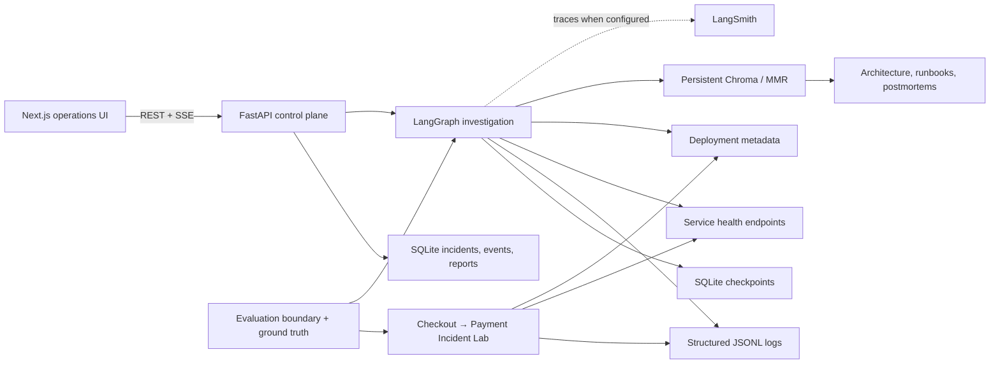

# TraceLens architecture

TraceLens V1 is a local, evidence-first investigation system. It deliberately keeps data
collection in ordinary application code and reserves model calls for typed interpretation.

## Trust boundary

The scenario controller changes service behavior and therefore knows ground truth. The evaluation
harness also knows expected categories. **Scenario ground truth is never available to TraceLens
during investigation.** Graph inputs contain only the public incident, request logs, deployment
records, service health, and retrieved operational documents. The API's public incident schema
also omits any internal scenario label.

## Runtime components

- `checkout-service` calls `payment-service` over HTTP with a shared `X-Request-ID` and a one-second
  timeout. Both persist structured JSON logs.
- The TraceLens FastAPI process stores incidents, semantic progress events, root-cause reports, and
  evaluation summaries in SQLite.
- The LangGraph workflow is explicit and bounded. Stable incident IDs are also checkpoint thread
  IDs.
- `langgraph-checkpoint-sqlite` writes graph state after every super-step. Reinvoking a terminated
  thread with no new input resumes from its latest checkpoint.
- Chroma persists knowledge chunks. OpenAI embeddings are used when configured; a documented local
  hash embedding keeps credential-free tests and product exploration executable.
- The frontend never receives OpenAI or LangSmith secrets. It subscribes only to safe semantic SSE
  events and fetches typed evidence/report records over REST.

## RAG flow

Markdown documents have a short front matter header with `document_type`, `service`, and
`failure_type`. Ingestion uses a recursive 800-character splitter with 120-character overlap: lab
runbooks are short, so this preserves a complete diagnostic procedure in most chunks while keeping
retrieval passages focused. Stable IDs follow
`<document_type>:<source-slug>:chunk-<index>`. The default retriever uses MMR with five returned
chunks from a ten-item candidate set.

Operational documents are guidance, not proof. Verification requires runtime evidence, and report
citations are filtered against the actual evidence registry.

## Persistence and restart

Application state and graph checkpoints use separate SQLite files to keep their ownership clear.
To demonstrate restart behavior:

1. Start an investigation and stop the backend during graph execution.
2. Restart the backend with the same database paths.
3. Call `POST /api/incidents/{id}/resume`.
4. Observe the existing checkpoint thread continue and the SSE endpoint replay durable events by
   event ID.

## Observability

LangChain and LangGraph emit traces automatically when `LANGSMITH_TRACING=true` and a
`LANGSMITH_API_KEY` are present. Invocation metadata includes incident/thread ID, retriever
strategy, graph version, and environment; tags carry the same coarse dimensions. The application
sets tracing to false and continues normally when credentials are absent.

## Evaluation boundary

The evaluation harness activates each scenario and generates real HTTP traffic, but passes only an
ordinary incident ID into the graph. Exact evaluators score category and service. Retrieval checks
chunk metadata, and groundedness confirms every final citation resolves. Results are stored in the
application database for the Evaluations screen.
