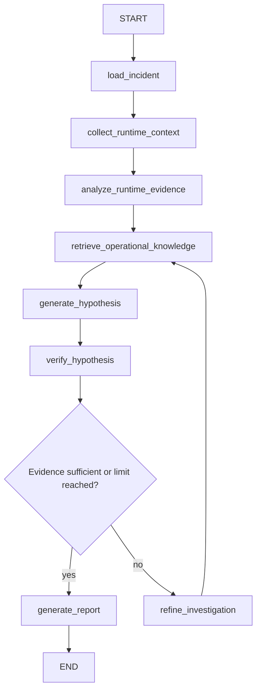

# Investigation flow

The graph state is an incident-domain `TypedDict`, not a chat transcript. Pydantic domain records
remain serializable through LangGraph's checkpoint serializer.

The first hypothesis sets `iteration_count` to one. Each refinement creates one more hypothesis.
`max_iterations` defaults to three total attempts, so no reasoning loop can run unbounded. At the
limit, report generation proceeds with explicit uncertainty.

## State fields

| Field | Purpose |
|---|---|
| `incident_id`, `incident` | Stable input and loaded public incident |
| `logs`, `deployments`, `service_health` | Deterministically collected runtime context |
| `runtime_analysis` | Typed anomaly analysis |
| `retrieval_query`, `retrieved_documents` | Current semantic query and MMR passages |
| `hypotheses`, `active_hypothesis` | Attempt history and current typed hypothesis |
| `evidence` | Resolvable registry of log, health, deployment, and document items |
| `verification` | Typed support/contradiction decision |
| `iteration_count`, `max_iterations` | Explicit loop bound |
| `final_report` | Typed report, present only after report generation |
| `errors` | Structured-output, retrieval, and citation validation failures |

## Nodes

### `load_incident`

- Input: `incident_id`
- Output: `incident`
- Behavior: loads SQLite data and marks the record investigating. It never loads scenario control
  state.

### `collect_runtime_context`

- Input: `incident`
- Output: `logs`, `deployments`, `service_health`, initial `evidence`
- Behavior: reads JSONL logs and deployment JSON, calls both health endpoints, and assigns stable
  evidence IDs. No model is involved.

### `analyze_runtime_evidence`

- Input: runtime context and incident metadata with internal scenario fields removed
- Output: `runtime_analysis`, `retrieval_query`, validation `errors`
- Behavior: requests a Pydantic `RuntimeAnalysis` when OpenAI is configured. A deterministic typed
  reasoner supports offline operation. Unknown model-produced citations are removed and recorded.

### `retrieve_operational_knowledge`

- Input: `retrieval_query`
- Output: `retrieved_documents`, document entries added to `evidence`
- Behavior: runs the persistent Chroma MMR retriever and preserves source metadata and chunk IDs.

### `generate_hypothesis`

- Input: runtime analysis and the complete evidence registry
- Output: appended `hypotheses`, `active_hypothesis`, incremented `iteration_count`
- Behavior: creates one Pydantic hypothesis. Citation IDs are resolved before the result is used.

### `verify_hypothesis`

- Input: active hypothesis and evidence registry
- Output: `verification`
- Behavior: checks whether the claimed failure has sufficient runtime support. Retrieved documents
  can explain a pattern but cannot independently verify that it occurred.

### `refine_investigation`

- Input: unresolved verification questions, current hypothesis/query
- Output: a focused `retrieval_query`
- Behavior: emits a visible refinement event and routes back to retrieval. It does not collect new
  evidence through arbitrary tools.

### `generate_report`

- Input: active hypothesis, verification, evidence, iteration counts
- Output: `final_report`
- Behavior: produces a typed `RootCauseReport`, rejects unknown citations, persists the report,
  updates incident status, and records limitations when verification remained insufficient.

## Routing condition

After verification, route to `generate_report` when `verification.is_sufficient` is true or
`iteration_count >= max_iterations`. Otherwise route to `refine_investigation`. No other loop or
agent exists in V1.

## Events

Nodes write semantic events to SQLite. SSE replays them in ID order and emits keep-alive comments
while idle. Events reveal stage, summary, counts, scores, and safe identifiers—not chain-of-thought
or raw hidden model reasoning.

